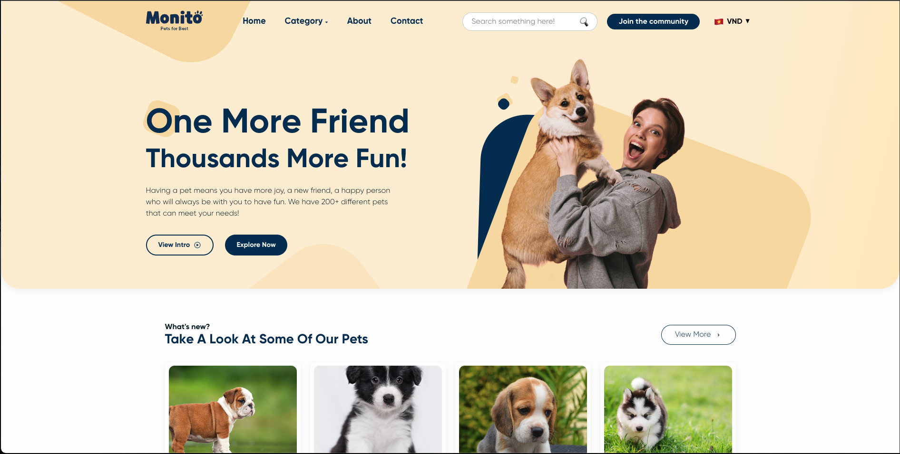
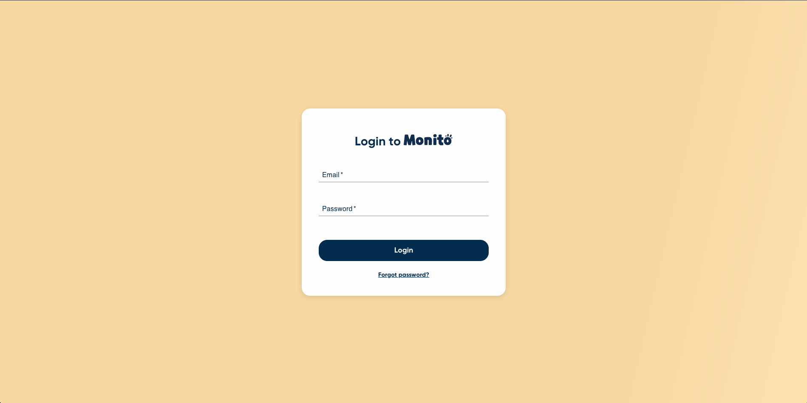
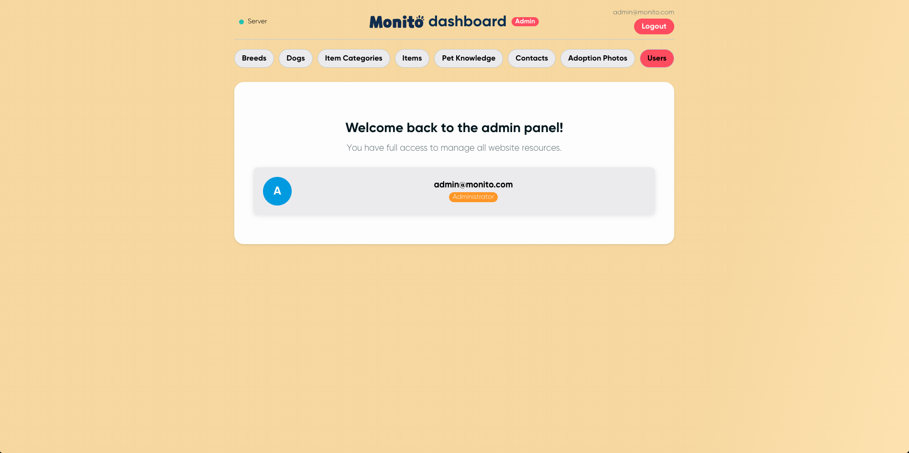

# 🐾 Ecommerce Pets

Implementation of CompassUOL Challenge 3: a comprehensive e-commerce platform for purebred pets, built with React (frontend) and NestJS (backend).


## 📋 Project Overview

This full-stack application provides a modern, user-friendly marketplace for purebred pets with emphasis on:

- **Detailed breed catalog** with high-quality images and comprehensive information
- **Advanced filtering system** for finding the perfect pet by breed, size, gender, price, and color
- **Educational content** through a Pet Knowledge section with breed-specific articles
- **Secure admin dashboard** for inventory management and content creation
- **Responsive design** that works across desktop and mobile devices

## 🛠️ Technology Stack

### Frontend
- React 18 with TypeScript
- React Router for navigation
- Context API for state management
- CSS Modules for styling
- Responsive design principles

### Backend
- NestJS 11 framework
- TypeScript for type safety
- PostgreSQL database with TypeORM
- JWT authentication
- RESTful API design
- Swagger API documentation

## 🔍 Key Features

- **Intuitive Product Browsing:** Easy-to-navigate catalog with detailed pet profiles
- **Advanced Search & Filters:** Find pets based on multiple criteria
- **Pet Knowledge Base:** Educational articles about pet care and breeds
- **Admin Dashboard:** Complete content management system
- **Responsive Design:** Optimized for all screen sizes

## 🚀 Getting Started

For detailed setup instructions, please refer to the individual README files:
- [Backend Documentation](https://github.com/PedroBolson/ecommerce-pets/blob/dev/backend/README.md)
- [Frontend Documentation](https://github.com/PedroBolson/ecommerce-pets/blob/dev/frontend/README.md)

### Quick Start

1. Clone the repository:
   ```bash
   git clone https://github.com/PedroBolson/ecommerce-pets.git
   cd ecommerce-pets
   ```

2. Set up the database:
    ```bash
    # Import the database dump into your PostgreSQL instance
    # You can find the SQL dump file in the DATA/dumps directory
    psql -U your_username -d your_database_name -f DATA/dumps/database_dump.sql
    ```

3. Set up the backend:
    ```bash
    cd backend  
    npm install  
    #Configure your .env file (see backend README for an example)
    npm run start:dev
    ```  

4. Set up the frontend:
    ```bash
    #In another terminal
    cd frontend
    npm install
    npm run dev # On dev environment already set for localhost API, for external API use .env file for front too
    ```

## 🌐 Deployment

This project was designed for AWS deployment. For local testing:
- Create PostgreSQL database locally
- Configure environment variables in backend/.env
- Update CORS settings to use localhost instead of AWS URLs

## 📊 Project Architecture

The project follows a modern web architecture:
- **Frontend:** Single-page application with component-based structure
- **Backend:** Modular API with clear separation of concerns (controllers, services, entities)
- **Database:** Relational database with well-defined entity relationships
- **Authentication:** JWT-based auth with role-based access control

## 🧪 Project Resources

### Screenshots & Administration Access

The `DATA/imgs` directory contains visual previews of key application interfaces:

#### Main Website

The public-facing storefront that customers use to browse pets and knowledge articles.

#### Admin Portal
To access the administration features:
1. **Admin Login:** Navigate to `/login` to access the secure authentication portal
   

2. **Content Dashboard:** After successful authentication, you'll be redirected to `/dashboard`
   
   
   From here, administrators can:
   - Manage pet listings and inventory
   - Create and edit knowledge articles
   - View sales statistics and user activity
   - Configure site settings

⚠️ **Note:** All administration routes are protected and require proper authentication credentials

### Database
The `DATA/dumps` directory contains PostgreSQL database dumps that you can use to populate your local database with sample data, including pet breeds, articles, and admin users.

## 🧠 Technical Challenges & Solutions

- **Image Management:** Implemented efficient storage and delivery for high-quality pet images
- **Complex Filtering:** Created a flexible filter system that maintains performance
- **State Management:** Built custom context providers for managing application state
- **Data Relationships:** Designed schema to represent complex relationships between breeds, pets, and knowledge articles

## 🔮 Future Enhancements

- E-commerce checkout integration
- User reviews and ratings
- Advanced search with AI recommendations
- Real-time chat with sellers
- Mobile application

## 👥 Contributors

- Pedro Bolson - Project Lead & Developer

## 📄 License

This project is licensed under the MIT License - see the LICENSE file for details.